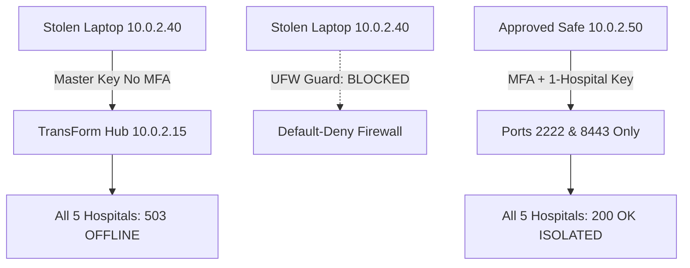

# Stage 3: Trust Boundaries & Blast-Radius Architecture

```mermaid
flowchart TD
    B_LAP[Stolen Laptop 10.0.2.40] -->|Master Key No MFA| B_HUB[TransForm Hub 10.0.2.15]
    B_HUB --> B_5[All 5 Hospitals: 503 OFFLINE]
    A_LAP[Stolen Laptop 10.0.2.40] -.->|UFW Guard: BLOCKED| A_FW[Default-Deny Firewall]
    A_SAFE[Approved Safe 10.0.2.50] -->|MFA + 1-Hospital Key| A_HUB[Ports 2222 & 8443 Only]
    A_HUB --> A_5[All 5 Hospitals: 200 OK ISOLATED]
```
